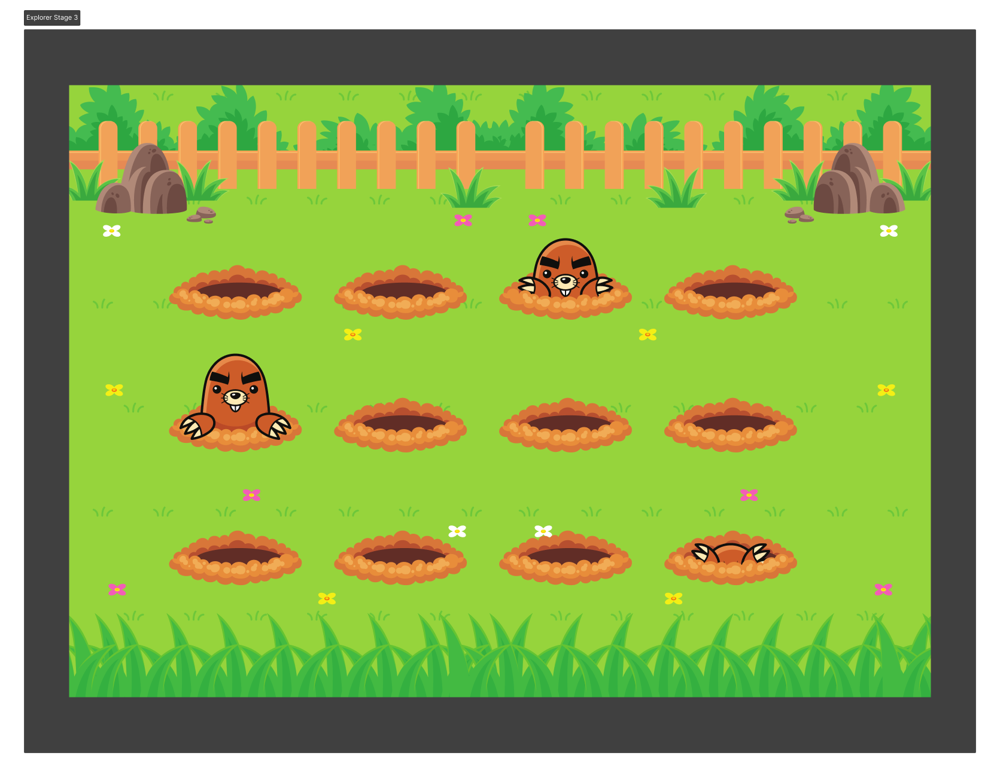

<h1 align="center"> Stage-03-Desafio-05  Jardim das Toupeiras </h1>

  <a href="#-tecnologias">Tecnologias</a>&nbsp;&nbsp;&nbsp;|&nbsp;&nbsp;&nbsp;
  <a href="#-projeto">Projeto</a>&nbsp;&nbsp;&nbsp;|&nbsp;&nbsp;&nbsp;
  <a href="#-layout">Layout</a>&nbsp;&nbsp;&nbsp;|&nbsp;&nbsp;&nbsp;
  <a href="#memo-licença">Licença</a>

  

 
  

    

## 🚀 Tecnologias

Esse projeto foi desenvolvido com as seguintes tecnologias:

- HTML 
- CSS
- Github
- Figma

## 💻 Projeto

  Neste Desafio 05, animações foram criadas usando KeyFrames, Display Flex e Display Grid para fazer com que as toupeiras apareçam no jardim.

      
 

- [Visite o projeto online](https://iaramarques.github.io/Stage03-Desafio05-Jardim-Das-Toupeiras/)

 

## 🔖 Layout

Você pode visualizar o layout do projeto através [DESSE LINK](https://www.figma.com/file/TG8ROxuGXCVVmpW4qRWdve/Wack-a-Mole-(Community)?node-id=0-1). É necessário ter conta no [Figma](https://figma.com) para acessá-lo. 

  

## :memo: Licença

Esse projeto está sob a licença MIT.

---

Feito com ♥ by Esio Almeda :wave: [Participe da comunidade da RocketSeat!](https://discord.gg/rocketseat)
